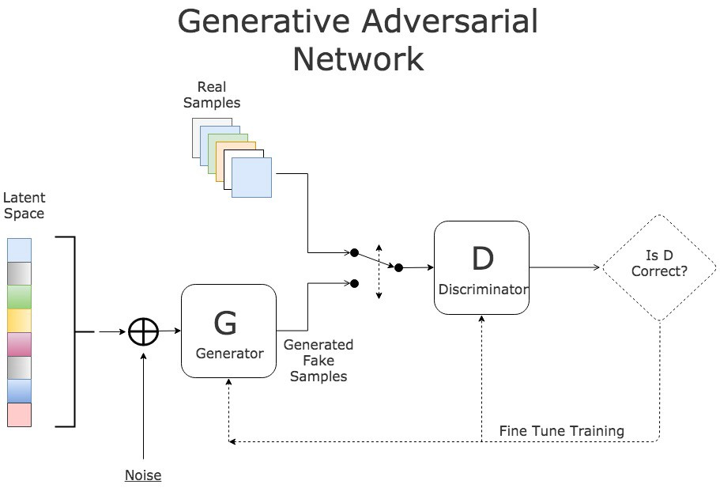

# PyTorch Generative Models
This repository provides implementations of various generative models using PyTorch, including Generative Adversarial Networks (GANs) and Variational Autoencoders (VAEs).

